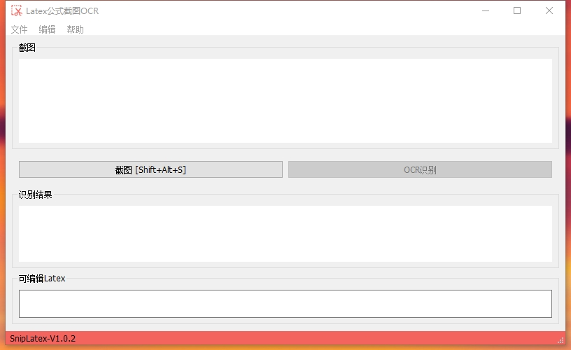
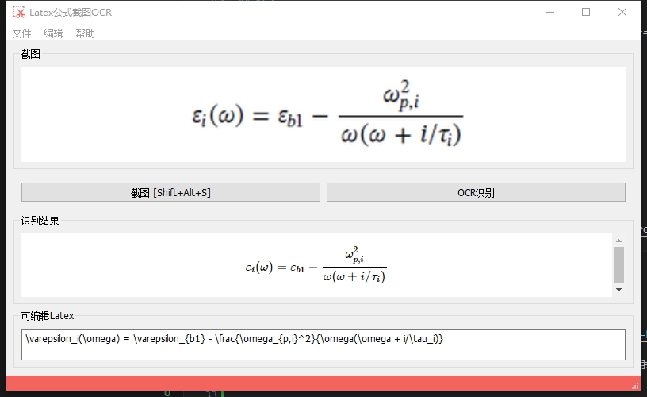

# snip_latex

snip_latex

在平时的学习过程中，记笔记成了很重要的一个部分，然而对于机器学习、深度学习方向的论文来说，充斥着大量的公式，每次使用 Markdown 编辑公式都成为痛苦的一部分，得益于 OCR 以及大模型的发展，我在想是不是能做一个软件，代替每次的公式编辑。

## 特点

- 采用 Python 开发，最大的特点是开发速度很快，对于绝大部分人来说也容易上手
- 支持快捷键截图，使得看文献的过程中不易被打扰
- 支持最小化托盘

## 开始使用

1. 克隆仓库：`git clone`
2. 安装必要的库：`pip install -r requirement.txt`
3. 启动程序：`python main.py`

### 大模型 API 的申请

1. 该代码已经在 [Qwen 的 qwen-vl-max 模型](https://www.aliyun.com/product/tongyi)下测试，可以到 Qwen 的官网上申请 API-Key;

2. 如果不想自己申请，也可以联系我，我这边有打包好的可执行文件。

### 识别结果

## 致谢

- 感谢 [LaTeX-OCR](https://github.com/lukas-blecher/LaTeX-OCR/)，界面上的设计很多借鉴了该项目